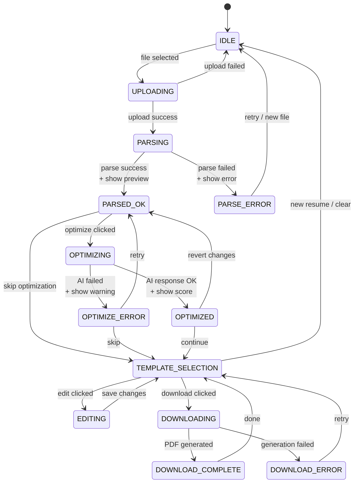
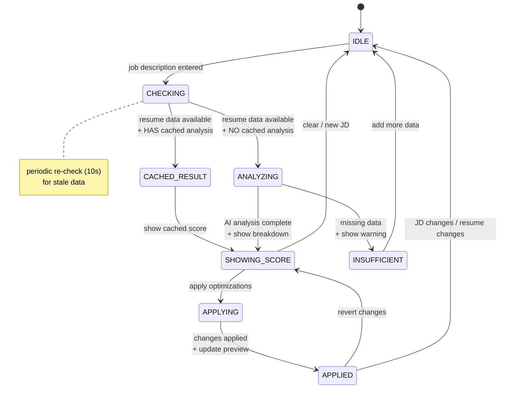
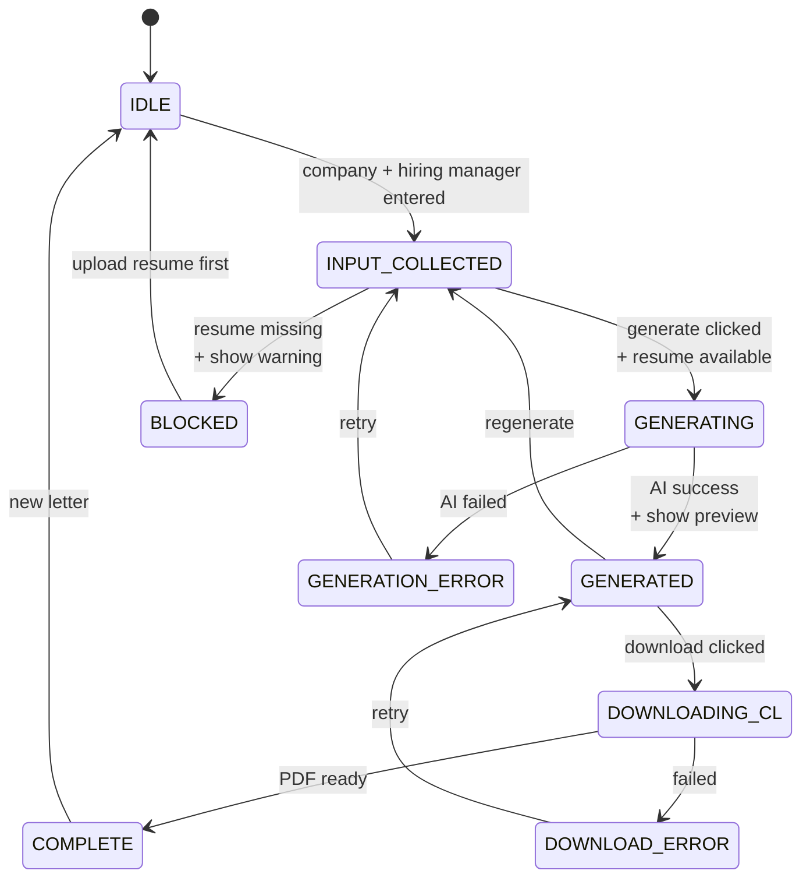
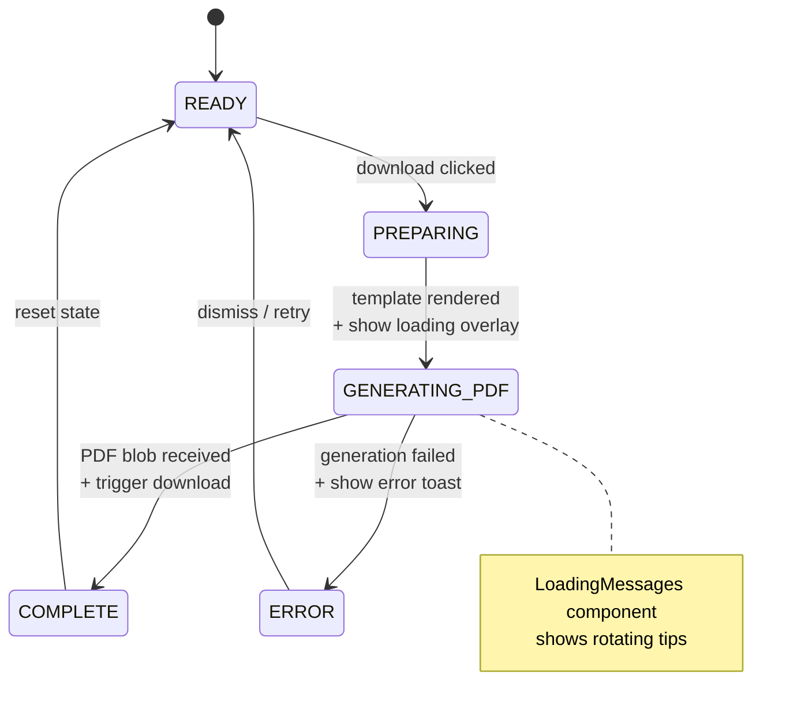
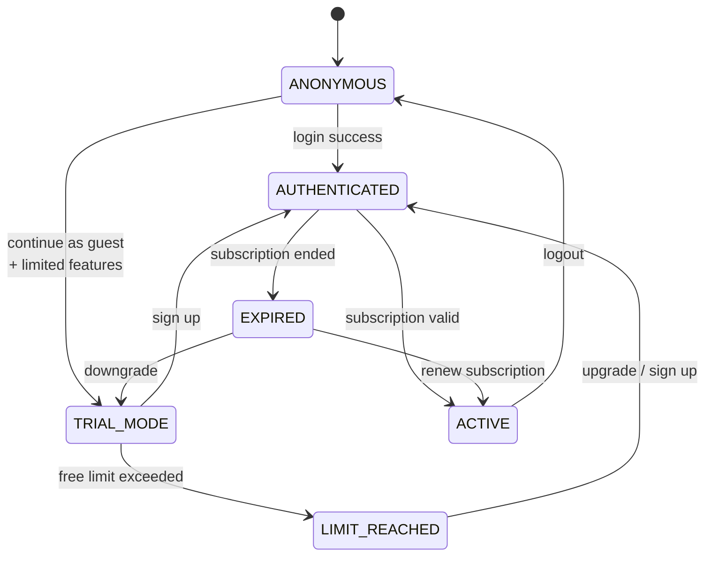

# State Machine Diagrams

## Resume Customizer - Main Flow

---

## Optimization State Machine

---

## Cover Letter Generation Flow

---

## PDF Download State Machine

---

## User Session States

---

## State Legend

| State Type | Meaning |
|------------|---------|
| `IDLE` | Waiting for user input |
| `*_OK` / `COMPLETE` | Success state |
| `*_ERROR` / `INSUFFICIENT` | Error/warning state |
| `*ING` (e.g., PARSING) | Processing/loading state |
| `BLOCKED` | Cannot proceed |
