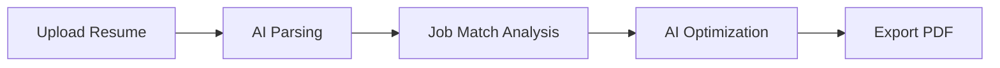

# � AI Resume Optimizer

> **Transform your resume into a job-winning document with AI-powered optimization tailored for the Saudi job market.**

[](https://resume-optimizing.netlify.app)
[](LICENSE)
[](https://react.dev)

---

## ✨ Overview

**AI Resume Optimizer** is a cutting-edge web application that analyzes your resume against job descriptions using advanced AI algorithms. Get actionable insights, keyword recommendations, and ATS-optimized suggestions to increase your chances of landing interviews in Saudi Arabia's competitive job market.

### 🎯 Key Features

- **🤖 AI-Powered Analysis** - Leverages OpenAI GPT-5 Nano for intelligent resume optimization
- **📊 Smart Matching** - TF-IDF similarity scoring with keyword extraction (0-100 match score)
- **� Multi-Format Support** - Upload PDF, DOCX, or paste text directly
- **🎨 Beautiful Export** - Generate styled or ATS-plain PDF versions
- **🔒 Privacy-First** - Secure storage with Supabase, delete anytime
- **⚡ Real-Time Processing** - Instant parsing and analysis with progress tracking
- **🌍 Saudi Market Focus** - Optimized for Vision 2030 job market requirements

---

## 🖥️ How It Works



1. **📤 Upload** - Drop your PDF/DOCX or paste resume text
2. **🎯 Match** - Enter job description to get 0-100 match score with keyword insights
3. **✨ Optimize** - AI generates tailored rewrite suggestions for each section
4. **💾 Export** - Save styled/ATS-plain PDF to your account or print

---

## 🚀 Quick Start

### Prerequisites

- Node.js 20+
- npm or yarn
- Netlify account (for deployment)
- OpenAI API key
- Supabase project

### Installation

```bash
# Clone repository
git clone https://github.com/abdullah7041/resume-customizer.git
cd resume-customizer

# Install dependencies
npm install

# Set up environment variables (see below)
cp .env.example .env

# Start development server
npm run dev
```

### Environment Variables

Create a `.env` file with:

```bash
# Supabase
VITE_SUPABASE_URL=your_supabase_project_url
VITE_SUPABASE_ANON_KEY=your_supabase_anon_key
SUPABASE_SERVICE_ROLE_KEY=your_service_role_key

# OpenAI
OPENAI_API_KEY=your_openai_api_key
OPENAI_MODEL=gpt-5-nano  # Optional: override model

# Optional
VITE_USE_MOCK_AI=false  # Set true to skip OpenAI calls in dev
VITE_BUILD_ID=dev       # Auto-generated in production
```

---

## 🛠️ Tech Stack

| Category | Technologies |
|----------|-------------|
| **Frontend** | React 19, Vite 7, Tailwind CSS v4 |
| **Backend** | Netlify Functions (TypeScript) |
| **AI** | OpenAI GPT-5 Nano (0.7 temperature) |
| **Storage** | Supabase (Auth + Storage) |
| **PDF Processing** | pdfjs-dist, custom DOCX parser |
| **Testing** | Vitest, Testing Library, happy-dom |

---

## 📚 Documentation

### Architecture

- **Frontend**: React SPA with client-side routing
- **Backend**: 4 serverless functions (`ai`, `match-score`, `parse-resume`, `optimize`)
- **Data Flow**: localStorage persistence + Supabase cloud storage
- **AI Pipeline**: Text normalization → TF-IDF analysis → OpenAI optimization

### Key Files

```
netlify/functions/
  ├── ai.ts               # OpenAI proxy (chat completions)
  ├── match-score.ts      # TF-IDF similarity engine
  ├── parse-resume.ts     # PDF/DOCX text extraction
  └── optimize.ts         # Legacy optimization endpoint

src/
  ├── components/         # UI components
  ├── features/           # Feature modules (Upload, Match, Optimize)
  ├── services/           # API clients (api.js, supabase.js)
  └── lib/                # Utilities (aiClient.ts, resumeText.js)
```

### Development

```bash
# Run with Netlify functions (RECOMMENDED)
npm run dev:netlify      # Starts Vite + functions on :8888

# Run frontend only (faster, but no backend functions)
npm run dev              # Vite only on :5173

# Testing
npm test                  # Run Vitest tests
npm run test:watch        # Run tests in watch mode
npm run lint              # ESLint check
./test-local.sh           # Full pre-deploy test suite

# Production build
npm run build             # Generates VITE_BUILD_ID + builds
npm run preview           # Preview production build
```

**📖 Before Deployment**: See [LOCAL_TESTING_GUIDE.md](LOCAL_TESTING_GUIDE.md) for comprehensive testing instructions.

---

## 🎨 Design System

Built with **Saudi Vision 2030** aesthetics:

- **Colors**: Emerald green (#0ea472), Royal teal (#075951), Saudi gold (#f4d37d)
- **Typography**: Inter, Tajawal, Geist fonts with generous letter-spacing
- **Effects**: Glassmorphism surfaces with soft shadows and blur
- **Theme**: Light/dark mode support with smooth transitions

Customize in `src/styles/theme.css` - all tokens use CSS variables for easy theming.

---

## 🔧 Configuration

### AI Settings

Default: GPT-5 Nano with **temperature 0.7** (reduced for consistency)

Override in `netlify/lib/ai-config.ts`:
```typescript
const FALLBACK_MODEL = "gpt-5-nano";
const DEFAULT_TEMPERATURE = 0.7;  // Lower = more factual
```

### Match Score Algorithm

TF-IDF cosine similarity (70%) + keyword coverage (30%)

- **75-100**: 🎯 Strong alignment
- **50-74**: ⚡ Moderate alignment  
- **0-49**: 🔧 Needs attention

---

## 📊 Performance

- **Parse Time**: ~2-3s for average resume
- **Match Analysis**: ~1-2s (no AI, pure text processing)
- **AI Optimization**: ~8-15s (depends on resume length)
- **Bundle Size**: ~450KB gzipped

---

## 🔒 Privacy & Security

- ✅ Resumes stored in Supabase with user ID prefixing
- ✅ All API keys server-side only (Netlify Functions)
- ✅ CORS-protected endpoints
- ✅ localStorage data validated for corruption
- ✅ No third-party trackers

**You control your data** - delete files anytime from your Supabase dashboard.

---

## 🐛 Troubleshooting

| Issue | Solution |
|-------|----------|
| 504 Gateway Timeout | Check `OPENAI_API_KEY` is set in Netlify |
| Binary data display | Clear localStorage: `localStorage.clear()` |
| Match score 0 | Ensure resume and job description both have 50+ words |
| PDF parsing fails | Try text paste or re-save PDF (may be scanned image) |

See `BUGFIX_SUMMARY.md` for detailed fixes.

---

## 🤝 Contributing

Contributions welcome! Please:

1. Fork the repository
2. Create feature branch (`git checkout -b feature/amazing`)
3. Commit changes (`git commit -m 'Add amazing feature'`)
4. Push to branch (`git push origin feature/amazing`)
5. Open Pull Request

---

## 📝 License

MIT License - see [LICENSE](LICENSE) for details

---

## 🌟 Acknowledgments

- OpenAI for GPT-5 Nano API
- Supabase for auth & storage infrastructure
- Tailwind CSS v4 for design system
- Saudi Vision 2030 for design inspiration

---

## 📬 Contact

**Project Maintainer**: Abdullah  
**Live Demo**: [resume-optimizing.netlify.app](https://resume-optimizing.netlify.app)  
**Issues**: [GitHub Issues](https://github.com/abdullah7041/resume-customizer/issues)

---

<div align="center">

**⭐ Star this repo if it helped you land a job! ⭐**

Made with ❤️ for the Saudi job market

</div>

