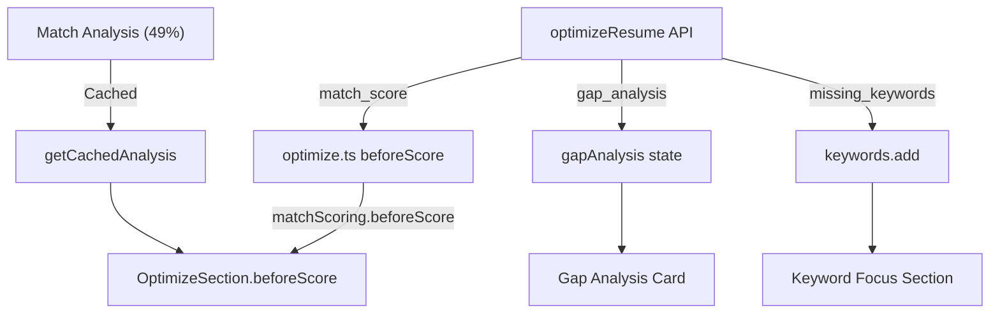

# Fix Optimization Logic - 5 Critical Bugs

Resolves issues identified from user testing showing Match Analysis score of 49% but Optimize section displaying incorrect data.


---

## Bug Summary

| # | Bug | Root Cause | Fix Location |
|---|-----|------------|--------------|
| 1 | Score Mismatch (49% vs 55%) | Line 166: `beforeScore = 55` hardcoded | `optimize.ts` |
| 2 | Only 1 Card | Prompt doesn't enforce minimum cards | `gemini-client.js` |
| 3 | Empty Gap Analysis | `gapAnalysis: []` returned empty | `gemini-client.js` + `optimize.ts` |
| 4 | Fake Optimize Numbers | Not syncing with Match Analysis cache | `OptimizeSection.tsx` |
| 5 | Keyword Focus Empty | `keywords.add` not populated from response | `optimize.ts` |

---

## Proposed Changes

### Backend

#### [MODIFY] [gemini-client.js](file:///c:/Users/NoteBook%20Pc/Desktop/resume-customizer/netlify/lib/gemini-client.js)

**Expand `optimizeResume` prompt** (Lines 880-935) to include gap analysis, category scores, and enforce minimum cards:

```diff
 export async function optimizeResume(resumeText, jobDescription) {
   const selectedModel = getModel('flash');

   const prompt = `
 You are an expert resume optimizer. Analyze this resume against the job description.

 ## JOB DESCRIPTION:
 ${jobDescription}

 ## RESUME:
 ${resumeText}

 ## CRITICAL RULES:
 1. For ALL "original" fields: COPY THE EXACT TEXT from the resume - NO paraphrasing
 2. For "improved" fields: Your enhanced version with metrics/action verbs
 3. Return ONLY the JSON structure below - no markdown, no explanations
+4. Bullet improvements are CONDITIONAL: If match_score >= 85, provide 1-2 minor improvements. If score < 85, provide 3-5 improvements targeting the weakest bullets
+5. Gap analysis is REQUIRED - identify at least 4 gaps between resume and JD requirements

 ## REQUIRED OUTPUT:
 {
   "original_headline": "<exact headline from resume or empty string>",
   "suggested_headline": "<your improved headline aligned with JD>",
   "original_summary": "<exact summary from resume or empty string>",
   "summary_rewrite": "<your improved summary>",
   "bullet_improvements": [
     {
       "original": "<EXACT bullet text from resume>",
       "improved": "<your enhanced version>",
       "issue": "<what's weak>",
       "rationale": "<why yours is better>"
     }
   ],
   "missing_keywords": ["<keyword1>", "<keyword2>"],
   "keywords_to_keep": ["<keyword1>", "<keyword2>"],
-  "keywords_to_avoid": ["<keyword1>", "<keyword2>"]
+  "keywords_to_avoid": ["<keyword1>", "<keyword2>"],
+  "gap_analysis": [
+    {
+      "requirement": "<JD requirement>",
+      "current_state": "<what resume has>",
+      "gap_severity": "critical|moderate|minor",
+      "recommendation": "<how to fix>"
+    }
+  ],
+  "category_scores": {
+    "hard_skills": {"score": 0-40, "max": 40, "reasoning": "<brief>"},
+    "experience": {"score": 0-30, "max": 30, "reasoning": "<brief>"},
+    "education": {"score": 0-15, "max": 15, "reasoning": "<brief>"},
+    "soft_skills": {"score": 0-15, "max": 15, "reasoning": "<brief>"}
+  },
+  "match_score": <sum of category scores, 0-100>
 }

-Provide 3-5 bullet improvements. Focus on the weakest bullets first.
+MANDATORY: 
+- Bullet improvements: 1-2 if score >= 85, otherwise 3-5 (based on weakest bullets)
+- Gap analysis: At least 4 items based on JD requirements
+- match_score MUST equal the sum of all category scores
 `;
```

**Increase token limit** for expanded response:

```diff
       generationConfig: {
         temperature: 0,
-        maxOutputTokens: 2048,  // Reduced for speed
+        maxOutputTokens: 3072,  // Increased for gap analysis
         topP: 0.95,
         topK: 1,
       }
```

---

#### [MODIFY] [optimize.ts](file:///c:/Users/NoteBook%20Pc/Desktop/resume-customizer/netlify/functions/optimize.ts)

**Bug 1 Fix: Remove hardcoded beforeScore** (Line 166):

```diff
-    // Calculate projected score improvement
-    const beforeScore = 55; // Default baseline score
+    // Use AI-calculated match score (required field)
+    const beforeScore = optimization?.match_score;
+    if (typeof beforeScore !== 'number') {
+      console.error('[optimize] AI did not return match_score');
+      throw new Error('AI optimization failed to calculate match score');
+    }
```

**Bug 3 Fix: Pass gap_analysis from optimizeResume** (Lines 206-207):

```diff
-        // Gap Analysis - simplified (not returned by optimizeResume)
-        gapAnalysis: [],
+        // Gap Analysis - from AI response
+        gapAnalysis: (optimization?.gap_analysis || []).map((gap: any) => ({
+          requirement: gap.requirement || '',
+          currentState: gap.current_state || '',
+          severity: gap.gap_severity || 'minor',
+          recommendation: gap.recommendation || ''
+        })),
```

**Bug 5 Fix: Keywords already populated correctly** (Lines 192-196) - verify data flows:

```typescript
// This already exists but verify optimization.missing_keywords is populated
keywords: {
  add: addKeywords,  // From optimization.missing_keywords
  neutral: optimization?.keywords_to_keep || [],
  remove: optimization?.keywords_to_avoid || []
},
```

**Add category scores to response**:

```diff
+        // Category Scores - NEW
+        categoryScores: optimization?.category_scores || null,
         // Score Breakdown - simplified (not returned by optimizeResume)
         scoreBreakdown: null,
```

---

### Frontend

#### [MODIFY] [OptimizeSection.tsx](file:///c:/Users/NoteBook%20Pc/Desktop/resume-customizer/src/components/sections/OptimizeSection.tsx)

**Bug 4 Fix: Ensure beforeScore syncs with Match Analysis** (Lines 299-303):

The logic already prioritizes `cachedAnalysis?.score` - verify it's being retrieved correctly:

```typescript
// Current code (correct priority order):
const beforeScore = cachedAnalysis?.score ??           // 1. Match Analysis score (49%)
  optimizationMetrics.beforeScore ??                    // 2. API-provided score
  ((originalResume?.meta as Record<string, unknown> | undefined)?.match_score as number) ?? 
  55;                                                   // 4. Fallback
```

**Potential issue**: The `getCachedAnalysis` may not find the cache if `resumeText` differs. Add logging:

```diff
+    console.log('[OptimizeSection] Cache lookup:', {
+      hasResumeText: !!resumeText,
+      hasJobDescription: !!jobDescription,
+      cachedScore: cachedAnalysis?.score,
+      fallbackScore: optimizationMetrics.beforeScore
+    });

     const beforeScore = cachedAnalysis?.score ??
```

**Update handleGenerate to capture category scores** (After line 493):

```diff
       // Capture score breakdown from API response
       if (data.scoreBreakdown) {
         setOptimizationMetrics({
           scoreBreakdown: data.scoreBreakdown,
         });
       }

+      // Capture category scores from API response
+      if (data.categoryScores) {
+        setOptimizationMetrics({
+          categoryScores: data.categoryScores,
+        });
+      }
```

---

## Data Flow Diagram



---

## Verification Plan

### Automated Tests

```bash
# 1. Run quality checks
npm run quality:check

# 2. Start local server
npm run dev:netlify

# 3. Test optimization API directly
curl -X POST http://localhost:8888/.netlify/functions/optimize \
  -H "Content-Type: application/json" \
  -d '{"resumeText": "Your resume text...", "jobText": "Job description..."}'
```

### Manual Verification Checklist

- [ ] Match Analysis shows 49% → Optimize shows 49% (not 55%)
- [ ] At least 3 optimization cards generated (Headline + Summary + Experience bullets)
- [ ] Gap Analysis shows 2+ items (not "No Critical Gaps")
- [ ] Keyword Focus → ADD section populated with missing_keywords
- [ ] Category scores displayed in Score Breakdown

### Success Criteria

| Metric | Before | After |
|--------|--------|-------|
| Cards Generated | 1 | 3-5 |
| beforeScore | 55% (fake) | 49% (from Match) |
| Gap Analysis | Empty | 2+ gaps |
| Keyword Focus ADD | Empty | 5-10 keywords |
